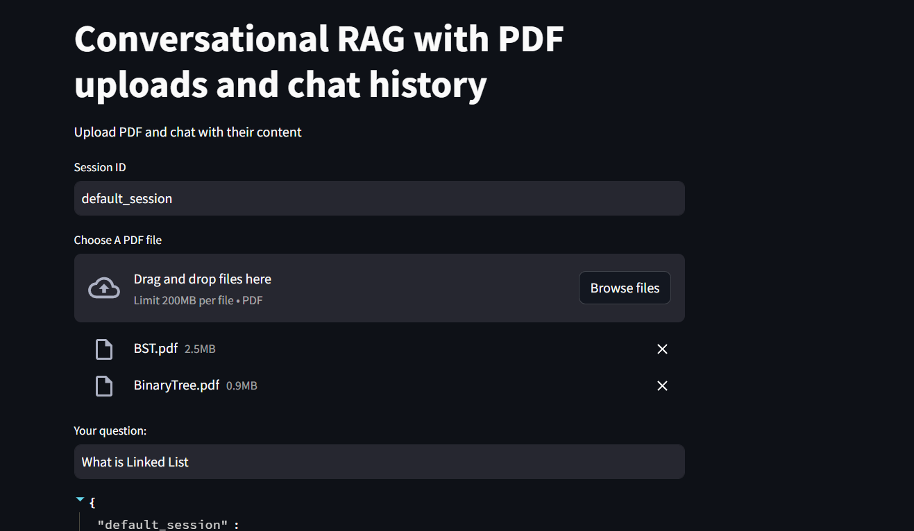
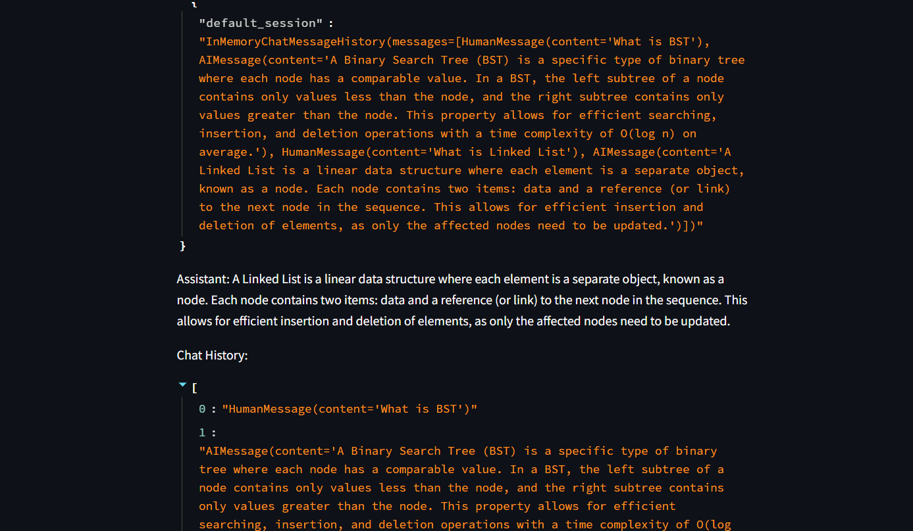
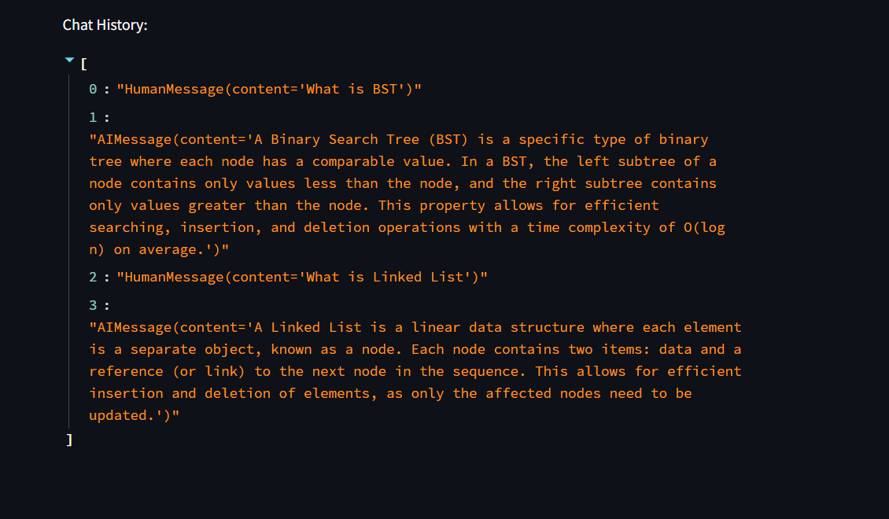

# RAG-ChatBot-with-Chat-History
📄 Conversational RAG Chatbot with PDF Uploads & Chat History

An end-to-end Retrieval-Augmented Generation (RAG) chatbot that allows users to upload multiple PDFs and interact with them conversationally. The system uses history-aware retrieval to provide contextually accurate answers.

🚀 Features

📂 Upload multiple PDF files

💬 Ask questions in natural language

🧠 Maintains chat history (session-based)

🔍 Context-aware retrieval using previous conversation

⚡ Fast responses using Groq LLM

📊 Embeddings powered by HuggingFace models

🛠️ Tech Stack

Frontend: Streamlit

LLM: Groq (LLaMA 3.1)

Framework: LangChain

Vector DB: Chroma

Embeddings: HuggingFace (all-MiniLM-L6-v2)

PDF Loader: PyPDF

🚀 Live Demo

🔗 Deployed App:

👉 https://rag-chatbot-with-chat-history-z.streamlit.app/

